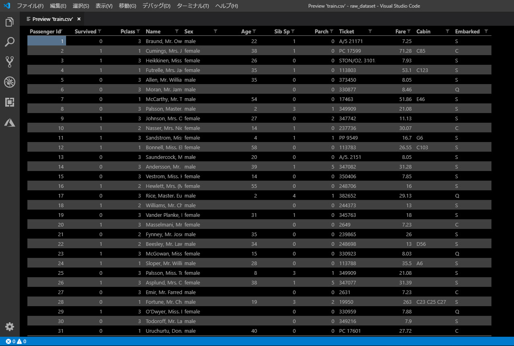
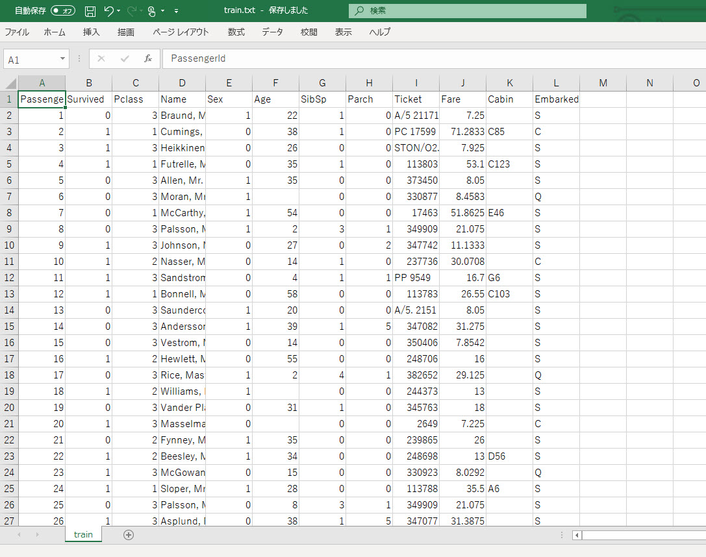
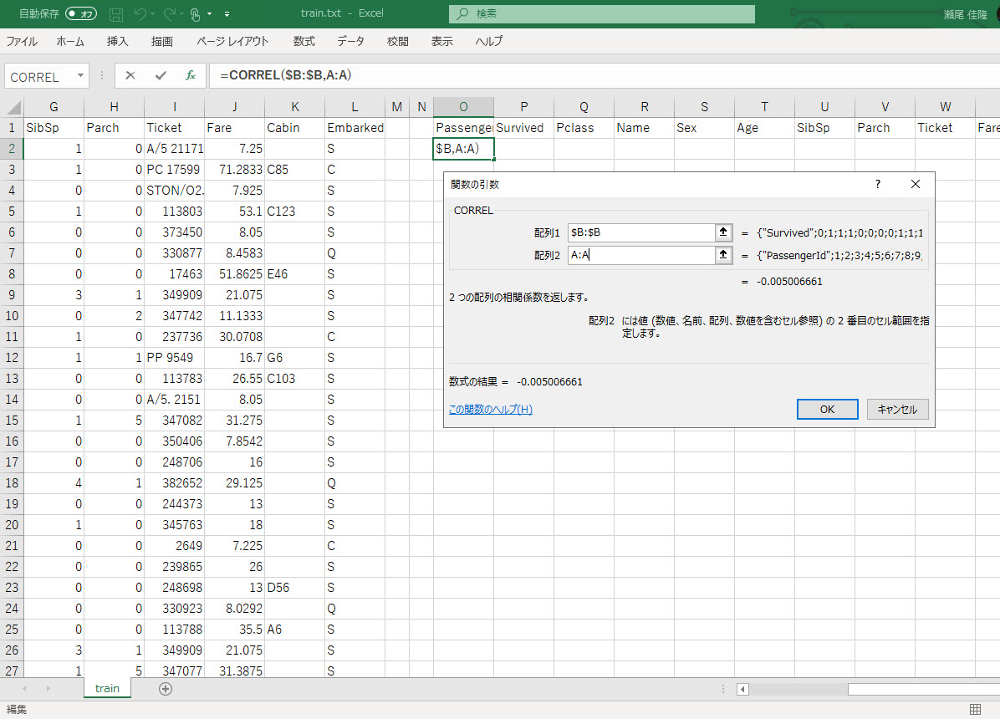
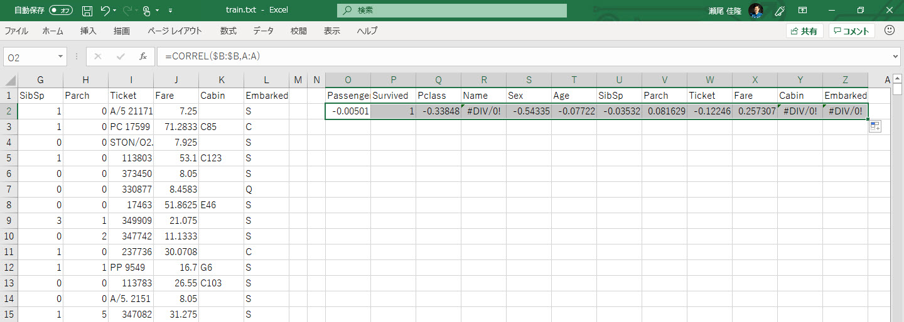
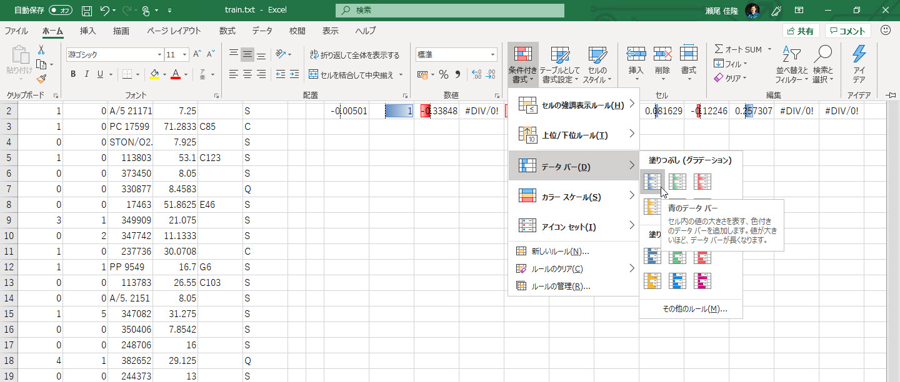
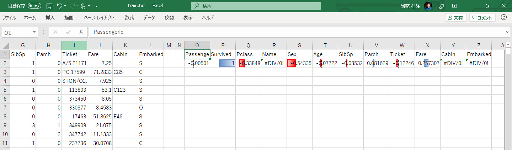

# データを整形して分析する

[前のステップ](./01_preparedata.md) で、学習に使用するデータを用意しました。

このステップでは、

- データの確認
- データの整形
- データの分析

を行います。

---

## データの確認

Kaggle からデータセットをダウンロードしました。  
ダウンロードしたデータは **CSV** 形式のデータです。  

- Age, Cagin, Embarked 列にデータの欠損がある（カンマが続く箇所が見つかる）
- Sex 列は male / female という文字列である

> データの確認をするために、ここでは **Visual Studio Code** を使いました。  
> [**Excel Viewer**](https://marketplace.visualstudio.com/items?itemName=GrapeCity.gc-excelviewer) 拡張機能のような CSV ファイルの閲覧機能があると便利ですが、今回は簡単な確認だけなので、テキストエディターだけで十分かもしれません。

---

## データの整形

データ確認を元に、以下の整形を行います。  
今回は、単純な **文字列置換** 3個と、ファイルフォーマットを **タブ区切りのテキストファイル** への変換でよさそうです。

> [**整形前のデータセット**](./dataset/raw_dataset.zip)（Kaggle からダウンロードしたもの）と  [**整形後のデータセット**](./dataset/format_dataset.zip)（以下の操作を行ったもの）とをあらかじめ作っておきました。
> [整形後のデータセット](./dataset/format_dataset.zip) をダウンロードして使えば、以下の整形の操作は不要です。すぐに **Excel でデータを分析** の手順に進むことができます。

いずれもこの後、Excel での分析（各列の相関係数の取得）と ML.NET での学習をやりやすくするための操作です。

|操作|対象|内容|利用するツール|備考|
|---|---|---|---|---|
|文字列置換|値の欠損を空文字列に置換| **,,** を **,"",** に置換|テキストエディター (VSCode 可)| |
|文字列置換|male を 1 に置換| **,male,** を **,1,** に置換|テキストエディター (VSCode 可)| |
|文字列置換|female を 0 に置換| **,female,** を **,0,** に置換|テキストエディター (VSCode 可)| |
|フォーマット変換|CSV を TSV に変換|Excel で [**名前を付けて保存**] で "**テキスト(タブ区切り)**" で保存|Excel (だと簡単)| Excel でタブ区切りで保存すると、ファイル拡張子は "txt" になる |

Excel で "**テキスト(タブ区切り)**" で保存すると拡張子は自動的に "**txt**" になります。  
ここでは "**train.txt**" というファイル名で保存します。

---

## Excel でデータを分析

整形後のデータを分析します。  
各列の **相関関係** を調べてみましょう。

1. 整形済みのデータセットを Excel で開きます。
2. 各列の見出しを O列以降にコピーします。
3. **O1** セルに以下の関数を設定します。  
   > =CORREL(\$B:\$B,A:A)

   これは、B列（Survived 列）に対する A列（Passanger 列）の相関係数を求めています。
   

4. **P1** ～ **Z1** に関数をコピーします。
   

5. [**ホーム**]-[**条件付き書式**]-[**データバー**] で　O1 ～ Z1 にデータバーを指定します。  
   

6. 以上で、Survived 列に対する各列の相関係数が求まりました。
   

1 に近いほど正の相関関係が強く、-1 に近いほど負の相関関係が強いことを示します。

Titanic データセットでは、予測したい値（目的変数と言います）と与えるパラメーター（説明変数と言います）との間には相関関係があり、質のよい学習できそうなデータです。  
"Survived" に対して、**Pclass, Sex が負の相関関係** を強く持ち、**Fare が正の相関関係** を強く持っていることが分かります。

つまり、

- Pclass が小さいほど助かりやすそう（一等室ほど助かりやすい）
- 男性 (Sex = 1)ならば助かりづらく、女性（Sex = 0）ならば助かりやすそう
- Fare が高いほど（高い料金を払っているほど）助かりやすそう

であることが分かります。

---

以上で、データの分析ができました。

[次のステップ](./03_preparedataload.md) では、いよいよ Visual Studio Code でコーディングを始めます。  
まずはアプリケーションの **プロジェクトを作り**、このステップで保存した **整形済みデータ** をプロジェクトに読み込みます。
