# データ読み込みの準備をする

[**データを分析**](./02_dataanalyze.md) して、[タイタニック号の乗船リスト](https://www.kaggle.com/c/titanic) には、予測したい列 (Survived) と十分な **相関関係** を持つ列があることが分かりました。  
適合率が高い学習モデルが作れそうです。

ここでは、

- 開発環境の構築（Visual Studio Code, .NET Core SDK をまだインストールしていない場合）
- アプリケーションのプロジェクトを新規作成
- 前のステップで保存した整形済みデータを読み込む

操作を順に行います。

---

## 開発環境の構築

今回は、Visual Studio Code で、学習モデルを作成するための .NET Core アプリケーションを新規作成します。  
すでに VSCode をインストール済みの場合、および .NET Core SDK をインストール済みの場合は、以下の手順は適宜スキップしてください。

> このコンテンツを作成する際には、Windows でのみ動作確認をしていますが、Mac, Linux でも同様の手順で学習モデルを作れるはずです。
> 手順の違う箇所、追加などがありましたら、Pull Request, Issues でお知らせください。（Windows 版の間違いについても同様にお知らせください）

1. [Visual Studio Code](https://code.visualstudio.com/) をインストールします。
2. [C# for Visual Studio Code](https://marketplace.visualstudio.com/items?itemName=ms-vscode.csharp) をインストールします。
3. [.NET Core SDK](https://dotnet.microsoft.com/download) をインストールします。

   > .NET Core は Runtime ではなく SDK を選択してインストールします。  
   >
   > Windows で Visual Studio (2017 以上) をインストール済みの場合には、.NET Core SDK がすでにインストールされているかもしれません。（選択したワークロードによります）

---

## 学習用アプリケーションの新規作成

学習用のアプリケーションを作成します。

ML.NET の学習アプリは、.NET Core コンソールアプリとして作ります。

1. **コマンドプロンプト**（Windows 以外では **ターミナル**、以下も適宜読み替えてください）を開きます。
2. コンソールアプリを作成する親フォルダー（任意、ここでは C:\Data）に移動します。
3. コンソールアプリのプロジェクト用のフォルダーを作成します。  
   ここでは "**TitanicTrain**" とします。
4. プロジェクト用のフォルダーに移動します。

   ```cmd
   cd \Data
   mkkdir TitanicTrain
   cd TitanicTrain
   ```

   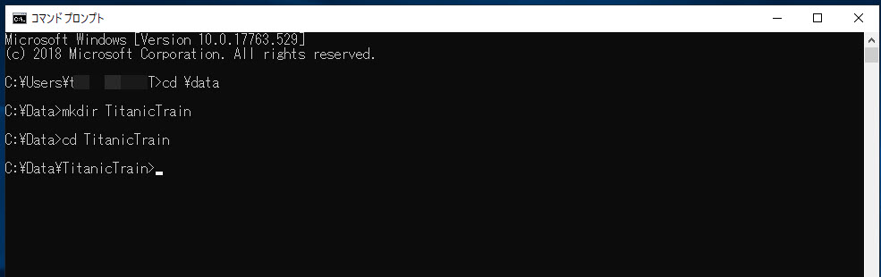

5. .NET Core コンソールアプリのひな形を作成します。

   ```cmd
   dotnet new console
   ```

   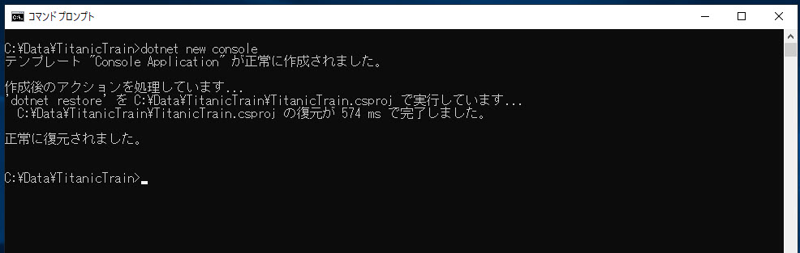

6. ML.NET のパッケージをプロジェクトにインストールします。  
   パッケージ名は "**Microsoft.ML**" です。

   ```cmd
   dotnet add package Microsoft.ML
   ```

   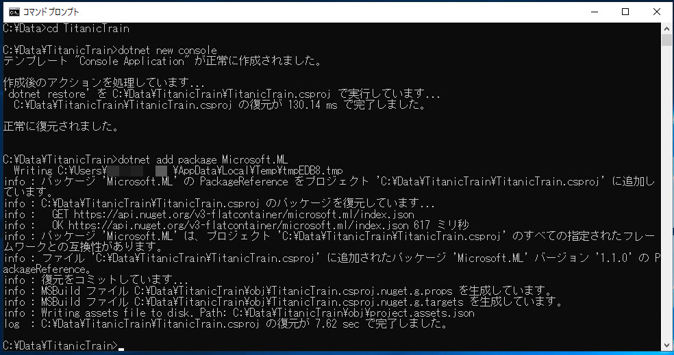

7. フォルダー（ディレクトリ）の中には以下のファイルが生成されているのが確認できます。

   - Program.cs
   - TitanicTrain.csproj

   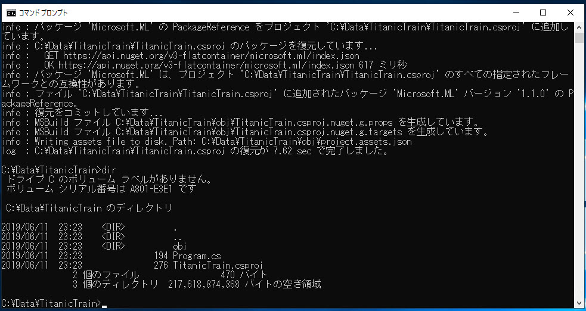

8. Visual Studio Code で "TitanicTrain" フォルダーを開きます。

   ```cmd
   code .
   ```

   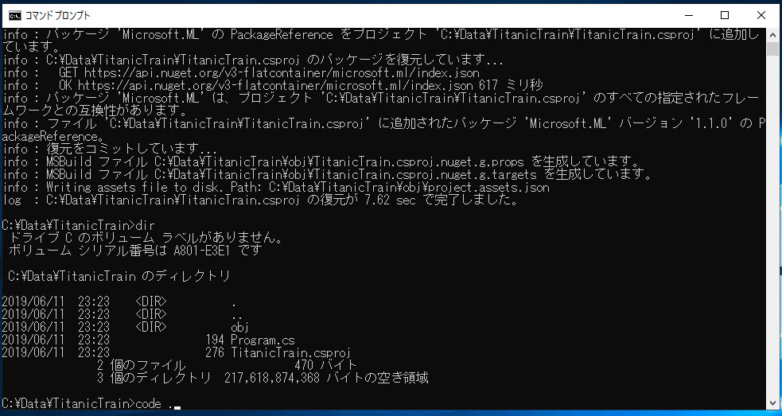

9. Visual Studio Code が開きます。  
   ここで "Required assets to build and debug ～" というメッセージが表示されたら "**Yes**" を選択します。  
   ".vscode" フォルダーが生成されて、VS Code 内でアプリケーションをデバッグ実行できるようになります。
   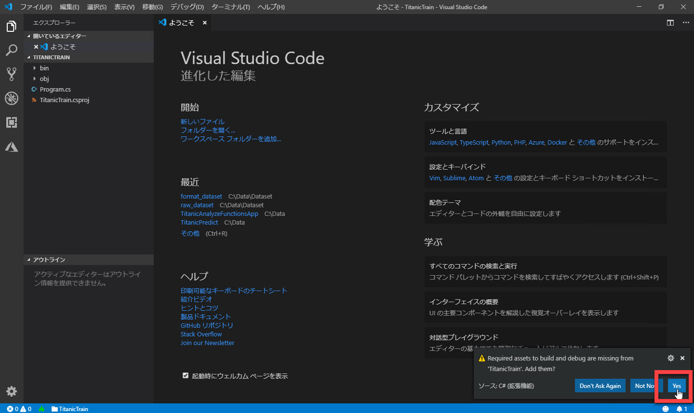

---

## データセットをプロジェクトフォルダー内に配置

[前のステップ](./02_dataanalyze.md) で作ったデータセット（タブ区切りのテキストファイル）をプロジェクトに取り込みます。

1. VSCode の **エクスプローラー** で [**新しいフォルダー**] をクリックして、"Data" フォルダーを作ります。  
   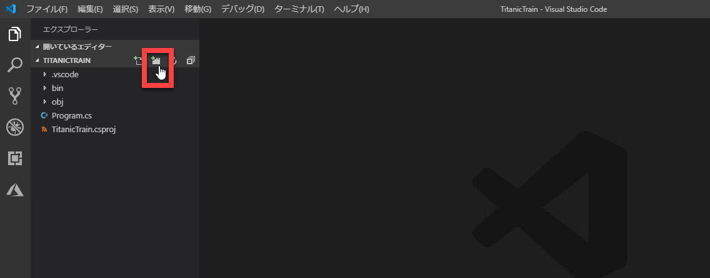

2. 前のステップで作成した "**train.txt**"（タブ区切りのテキストファイルで保存したもの）を Data フォルダーにコピーします。  
   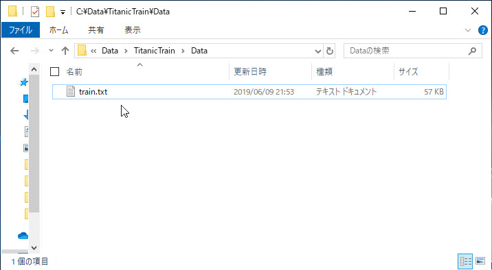
   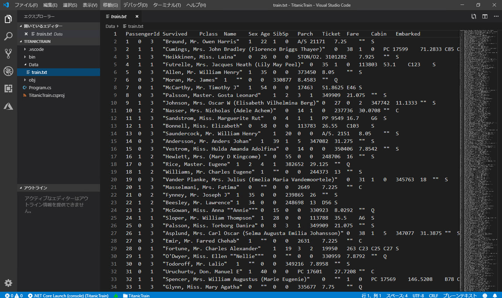

3. この後コーディングするアプリケーションで参照できるように、"train.txt" をビルド時に出力フォルダー（bin フォルダー）にコピーするようにします。  
   プロジェクトファイル (csproj ファイル) を開きます。  
   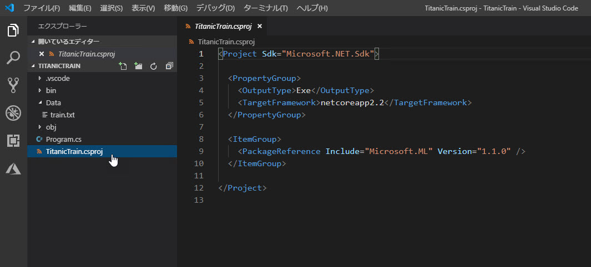

4. csproj の "**\</Project\>**" の上に、以下のコードを追加します。

   ```xml
   <ItemGroup>
     <Content Include="Data\train.txt">
       <CopyToOutputDirectory>PreserveNewest</CopyToOutputDirectory>
     </Content>
   </ItemGroup>
   ```

   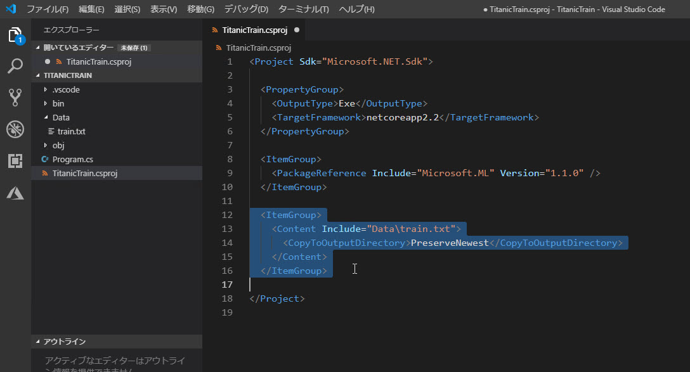

   > "train.txt" が更新されていればビルド時に出力フォルダーにコピーされます。

> データセットを取り込むには、プロジェクト内のファイルを読み込む以外に、クラウドなどのデータストアからダウンロードするやり方もあります。  
> 今回は学習モデルを作ることに集中するため、データセットの読み込みはクラウドからのダウンロードするのではなく、ローカルのファイルを使用することにします。

---

以上で、アプリケーションの実行時に "train.txt" を利用できるようになりました。  
[次のステップ](./04_createmodel.md) では、このデータセットをアプリケーションに読み込んで学習するコードを記述します。
