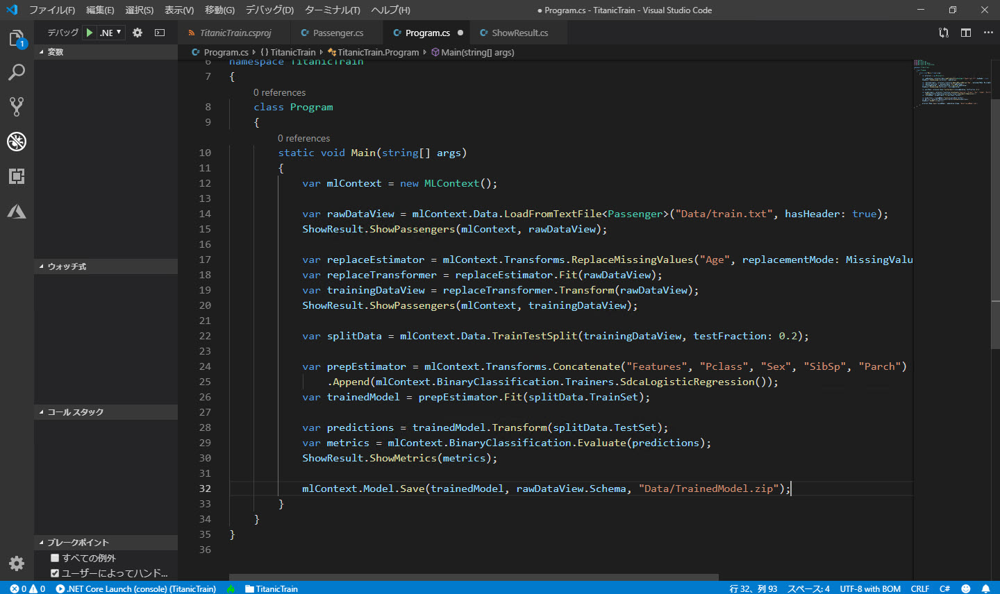

# モデルを作成する

タイタニック号の乗船リストの [**データを分析**](./02_dataanalyze.md) した結果、以下の特徴が分かりました。

- Survived を予測する上では、PassengerId, Name, Ticket, Cabin, Embarked は必要なさそうです。  
これらは直感的にも理解しやすいと思います。例えば、氏名によって助かりやすい・助かりづらいということはなさそうです。（仮に名前の順で部屋が割り当てられていれば、Name と Survived との間に相関があったかもしれません。ただしデータを分析した限りでは、それはなさそうです）
- Age 列にデータの欠損があります。  
Age が空の行を削除する方法もありますが、今回は Age が空のものには年齢の平均値を入れることにします。Age と Survived との間には相関関係はありますが弱い相関なので、平均値を入れても大きな問題にはならないでしょう。  

   > これらの特徴が「予測に大きく影響することはない」とは言い切れません。  
   > 現実の機械学習では、可能な範囲でいくつか異なる学習モデルを作ってみた上で、最適なものを選択するのがよいでしょう。（例えば、Age が欠損した行は削除する、Cabin も学習するなど、条件を変えてみて）

[**前のステップ**](./03_prepareloaddata.md) で、アプリケーションのプロジェクトを作成し、データセットを利用できるようになりました。

このステップでは、上記を元に **データをさらに整形** しながらアプリケーションに読み込み、学習モデルを作成します。

ここでの整形の内容は以下の通りです。

- データセットを学習に使用する列だけにする
- 欠損している Age 列に平均値を補完する

---

## エンティティクラスの定義

[前のステップ](./03_prepareloaddata.md) でアプリケーションのひな形が作成できたので、いよいよコーディングを始めます。

最初に **エンティティクラス** を定義します。  
これにデータを読み込んで学習します。まずは入れ物を用意します。

1. Visual Studio Code のエクスプローラーで "**Data**" フォルダーを選択した状態で、[**新しいファイル**] をクリックしてファイルを追加します。  
   ファイル名は　"**Passenger.cs**"  とします。  
   
   

2. "**Passenger.cs**" に以下のコードを入力します。

   ```csharp
   using Microsoft.ML.Data;

   namespace TitanicTrain
   {
       public class Passenger
       {
           [LoadColumn(1)]
           [ColumnName("Label")]
           public bool Survived { get; set; }
  
           [LoadColumn(2)]
           public float Pclass { get; set; }

           [LoadColumn(4)]
           public float Sex { get; set; }

           [LoadColumn(5)]
           public float Age { get; set; } = float.NaN;

           [LoadColumn(6)]
           public float SibSp { get; set; }

           [LoadColumn(7)]
           public float Parch { get; set; }

           [LoadColumn(9)]
           public float Fare { get; set; }
       }
   }
   ```

   - "**LoadColumn**" 属性は、この後で読みこむデータセットの列インデクスを指定します。  
   例えば、Survived には、タブ区切りファイルの 1列目の値を取り込むことを意味します。
   - "**ColumnName(\"Label\")**" 属性は、この列が **予測対象** であることを指定するものです。  
   現在の ML.NET では、予測対象はカラム名として "**Label**" を指定します。  
   今回も予測対象とする "Survived" に "Label" というカラム名を指定します。
   - "Age" プロパティには、デフォルト値として "float.NaN" を指定しています。これがないと、データセットを読み込むと Age が欠損している箇所は **0** で補完されます。

   > 予測対象の名前として別のものを使うこともできますが、"Label" のままのほうが分かりやすいでしょう。  
   > 別の学習モデルを作成する場合にも、予測対象は何かがすぐに分かるメリットがあります。

   

---

## データセットの読み込み

"**Program.cs**" に、

- データセットの読み込み
- 学習
- 評価
- 予測モデル（学習済みモデル）の保存

のコードを記述していきます。

最初に、**データセットを読み込み** ます。

1. "Program.cs" を開きます。
2. ファイル先頭の using ディレクティブを以下のコードに置き換えます。

   ```csharp
   using System;
   using Microsoft.ML;
   using Microsoft.ML.Data;
   using Microsoft.ML.Transforms;
   ```

3. "**Main**" メソッドの中身を以下のコードに置き換えます。

   ```csharp
   var mlContext = new MLContext();

   var rawDataView = mlContext.Data.LoadFromTextFile<Passenger>("Data/train.txt", hasHeader: true);
   ShowResult.ShowPassengers(mlContext, rawDataView);
   ```

   

   > この時点では、ビルドエラーが発生し、アプリケーションを実行することはできません。次の手順で解消します。

   - "**new MLContext()**" は文字通り、これから機械学習をするコンテキストを生成します。  
   データ読み込み、学習、評価、予測は、すべてこのコンテキストの中で行います。
   - "**mlContext.Data.LoadFromTextFile\<Passenger\>()**" は、引数で指定したテキストファイル（train.txt）を Passenger クラスに読み込むことを意味します。
   - "**ShowPassengers()**" は必須のコードではありませんが、この後でデータセットの読み込み結果を確認するために記述します。

---

## データセットを読み込めたことを確認

データセットを読み込めたことを確認してみます。

1. Visual Studio Code の [**新しいファイル**] をクリックして、ファイルを追加します。  
   ファイル名は　"**ShowResult.cs**"  とします。
2. "ShowResult.cs" を開いて、以下のコードで全体を置換します。

   ```csharp
   using System;
   using System.Linq;
   using Microsoft.ML;
   using Microsoft.ML.Data;

   namespace TitanicTrain
   {
       internal class ShowResult
       {
           internal static void ShowPassengers(MLContext mlContext, IDataView dataView)
           {
               Console.WriteLine("");
               Console.WriteLine("----------------");
               Console.WriteLine("");
               Console.WriteLine("Surv\tPclass\tSex\tAge\tSibSp\tParch\tFare");
               Console.WriteLine("");

               var preview = mlContext.Data.CreateEnumerable<Passenger>(dataView, reuseRowObject: false).Take(20);
               foreach (var p in preview)
               {
                   Console.WriteLine($"{p.Survived}\t{p.Pclass}\t{p.Sex}\t{p.Age:F1}\t{p.SibSp}\t{p.Parch}\t{p.Fare}");
               }
           }
       }
   }
   ```

   データセットの先頭 20行を表示します。

   

3. Visual Studio Code で [**デバッグ**]-[**デバッグの開始**] をクリックします。  
   ビルドが始まり、自動的にアプリケーションがデバッグ実行されます。

   

4. デバッグコンソールに、読み込んだデータセットの先頭 20行が表示されます。  
   正しく読み込めたことを確認します。  
   

   > Age 列の欠損している箇所には "**NaN**" と表示されます。  
   > あとの手順で、この個所に Age の平均値で補完します。

---

## データ欠損の補完

"Age" 列にはデータが欠損している箇所が複数あります。  
今回は、欠損している箇所は **Age の平均値** で補完します。

1. "Program.cs" を開きます。
2. "**Main**" メソッドの最後に以下のコードを追加します。

   ```csharp
   var replaceEstimator = mlContext.Transforms.ReplaceMissingValues("Age", replacementMode: MissingValueReplacingEstimator.ReplacementMode.Mean);
   var replaceTransformer = replaceEstimator.Fit(rawDataView);
   var trainingDataView = replaceTransformer.Transform(rawDataView);
   ShowResult.ShowPassengers(mlContext, trainingDataView);
   ```

   

3. [**デバッグ**]-[**デバッグの開始**] をクリックします。  
   ビルドが始まり、自動的にアプリケーションがデバッグ実行されます。  
   データセット読み込み後に Age に "NaN" であった箇所が、平均値 (29.7) に置換されたことを確認します。

   

---

## データセットを訓練用データと評価用データに分割する

学習には、 **訓練** 用のデータと **評価** 用のデータが必要です。
データセット（訓練データ）で訓練することで、モデルは "知能" を獲得します。ただし、それだけではどのくらい "賢くなったか" が分かりません。
そこで、**訓練に使っていないデータセット** でモデルを評価します。これによって、学習済みモデルがどれだけの精度で予測できるかを数値化できます。

> 訓練に使ったデータセットは評価には使いません。学習済みモデルは訓練用データの正解を知っているからです。

訓練データと評価データとが、あらかじめ分けられていることもありますが、区別なく "**ひとかたまり**" のデータセットとして提供されることも多くあります。

そのような場合には、読み込んでデータの整形が終わったところで、データセットを **二組に分けます** 。そのうち一方を訓練に、もう一方を評価に使います。  
データ総数や使用するアルゴリズムにもよりますが、70～80% 程度を訓練用のデータとし、それ以外を評価用のデータとすることが多いように思います。

1. "**Main**" メソッドの最後に以下のコードを追加します。

   ```csharp
   var splitData = mlContext.Data.TrainTestSplit(trainingDataView, testFraction: 0.2);
   ```

   

   "**0.2**" とは、評価用データに 20% (0.2)、残り（0.8・・・80%）を訓練用データに分けることを意味します。

   > 分ける比率は決まっているわけではありません。可能であれば、比率を変えて何度か学習して一番いいモデルを採用します。  

---

## 訓練用データで訓練する

機械学習（深層学習を含む）では、データの他にもう一つ大事なものがあります。  
「**アルゴリズム** ＝データを学習する手順・方法」 です。  
選択したアルゴリズムによって、学習モデルの適合度（どのくらい賢いか）が変わってきます。

今回は、SdcaLogisticsRegression (= binary logistic regression classification model using the stochastic dual coordinate ascent method) で、データセットを訓練します。  
これによって、モデルが知能を獲得します。

> 今回使っているタイタニック号の乗船リストはシンプルな構造なので、実際にはアルゴリズムごとにそれほど大きな差は生じないはずです。

1. "**Main**" メソッドの最後に以下のコードを追加します。

   ```csharp
   var prepEstimator = mlContext.Transforms.Concatenate("Features", "Pclass", "Sex", "SibSp", "Parch")
       .Append(mlContext.BinaryClassification.Trainers.SdcaLogisticRegression());
   var trainedModel = prepEstimator.Fit(splitData.TrainSet);
   ```

   

   - "**Concatenate**" メソッドでは、パラメーターとして与えるカラム名（説明変数）を指定します。
   - "**Estimator**" (= 学習を実施する主体) の処理のパイプラインに "**SdcaLogisticRegression**" での訓練を追加します。
   - "**Fit**" メソッドで、Estimator が訓練を行います。これによって、**学習モデル** が作成されます。

---

## モデルを評価する

訓練が終わりましたが、モデルの "**賢さ**" は不明です。そこで続いて学習モデルを **評価** します。  
評価に使用するデータとして、評価用として分割しておいたものを使います。

1. "**Main**" メソッドの最後に以下のコードを追加します。

   ```csharp
   var predictions = trainedModel.Transform(splitData.TestSet);
   var metrics = mlContext.BinaryClassification.Evaluate(predictions);
   ShowResult.ShowMetrics(metrics);
   ```

   

   - 訓練したモデルに評価用データを読み込みます。
   - 評価を実施します。
   - 評価結果を表示します。（"ShowMetrics" メソッドはこの後で追加するので、今の時点ではビルドに失敗します。まだ動作しません。）

2. "ShowResult.cs" を開きます。
3. ShowResult クラスの最後に以下のコードを追加します。

   ```csharp
   internal static void ShowMetrics(CalibratedBinaryClassificationMetrics metrics)
   {
       Console.WriteLine("");
       Console.WriteLine("----------------");
       Console.WriteLine("");

       Console.WriteLine($"Accuracy: {metrics.Accuracy}");
       Console.WriteLine($"F1 Score: {metrics.F1Score}");
   }
   ```

   

4. [**デバッグ**]-[**デバッグの開始**] をクリックします。  
   アプリケーションがデバッグ実行され、評価結果が表示されます。

   

   "**Accuracy**" と "**F1 Score**" とが表示されます。どちらも **1** に近いほど、優秀なモデルであることを表します。

   > "Accuracy" はモデルの "精度" を表します。"F1 Score" は総合的な "成績" を表します。

---

## 学習モデルを保存する

ここまでの手順で学習は完了しましたが、アプリケーションを終了すると学習モデルは失われてしまいます。

そこで、学習モデルをファイルに保存します。

これにより次のステップで、予測モデルを作成してサービスとして発行できるようになります。

1. "Program.cs" を開いて、"**Main**" メソッドの最後に以下のコードを追加します。

   ```csharp
   mlContext.Model.Save(trainedModel, rawDataView.Schema, "Data/TrainedModel.zip");
   ```

   

2. [**デバッグ**]-[**デバッグの開始**] をクリックします。  
   アプリケーションがデバッグ実行され、学習済みモデルが保存されます。
   保存先は "**\<プロジェクトフォルダー\>\\Data\TrainedModel.zip**" です。

   

---

以上で、学習モデルを作成できました。  
[次のステップ](./05_predictmodel.md) では、学習済みモデルから予測モデルを作成します。さらにサービスとしてクライアントから利用できるようにします。
