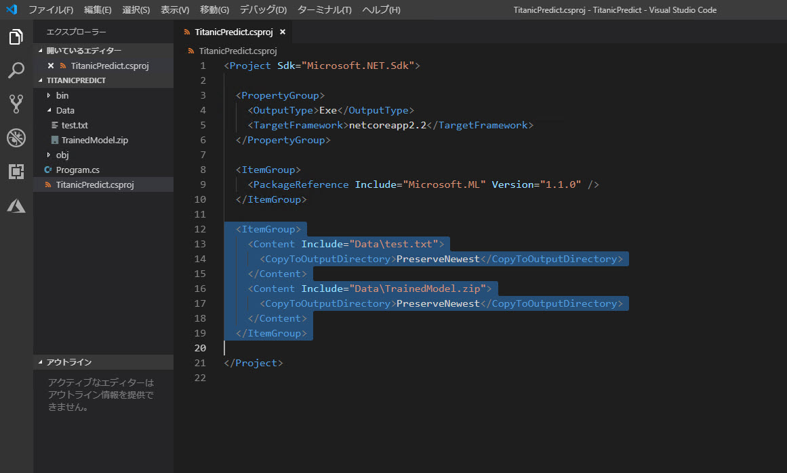

# 予測モデルを作成する

[前のステップ](./04_createmodel.md) でデータセットを学習して、モデルをファイルとして保存しました。

ここからは保存した学習済みモデルから予測モデルを作成して、実際に予測を行います。


> 実際には、予測モデルは Web サービスなどとして実行させて、クライアントから呼び出せるようにします。  
> あとのステップでサービス化しますが、その前にこのステップではコンソールアプリで予測を行ってみます。

---

## 予測アプリケーションの新規作成

予測アプリケーションを新しく作成します。  
学習用アプリケーションと同様に、ここでは .NET Core コンソールアプリにします。

1. **コマンドプロンプト**（Windows 以外では **ターミナル**、以下も適宜読み替えてください）を開きます。
2. コンソールアプリを作成する親フォルダー（任意、ここでは C:\Data）に移動します。
3. コンソールアプリのプロジェクト用のフォルダーを作成します。  
   ここでは "**TitanicPredict**" とします。
4. プロジェクト用のフォルダーに移動します。

   ```cmd
   cd \Data
   mkkdir TitanicPredict
   cd TitanicPredict
   ```

   

5. .NET Core コンソールアプリのひな形を作成します。  
   続いて、ML.NET のパッケージをプロジェクトにインストールします。

   ```cmd
   dotnet new console
   dotnet add package Microsoft.ML
   ```

   

6. Visual Studio Code で "TitanicPredict" フォルダーを開きます。

   ```cmd
   code .
   ```

---

## 学習済みモデルおよびテスト用のデータセットをプロジェクトフォルダー内に配置

前のステップで作った学習済みモデルのファイル、およびテスト用のデータセットをプロジェクトに取り込みます。

1. VSCode の **エクスプローラー** で [**新しいフォルダー**] をクリックして、"Data" フォルダーを作ります。  
   

2. テスト用のデータセットは [最初のステップ](./01_preparedata.md) で Kaggle からダウンロードした "test.csv" を元に以下の手順で整形します。  
   タブ区切りのテキストファイルは、ファイル名 "**test.txt**" で保存します。

   > このコンテンツの2番目、[データを整形して分析する](./02_dataanalyze.md) ステップで、"train.csv" に対して行った整形と同じです。　　
   >  
   > 整形済みのデータセット (test.txt) を [**こちら**](./dataset/format_dataset.zip) に用意しました。整形の手順を省略したい場合やうまく整形できない場合などにお使いください。

   |操作|対象|内容|利用するツール|備考|
   |---|---|---|---|---|
   |文字列置換|値の欠損を空文字列に置換| **,,** を **,"",** に置換|テキストエディター (VSCode 可)| |
   |文字列置換|male を 1 に置換| **,male,** を **,1,** に置換|テキストエディター (VSCode 可)| |
   |文字列置換|female を 0 に置換| **,female,** を **,0,** に置換|テキストエディター (VSCode 可)| |
   |フォーマット変換|CSV を TSV に変換|Excel で [**名前を付けて保存**] で "**テキスト(タブ区切り)**" で保存|Excel (だと簡単)| Excel でタブ区切りで保存すると、ファイル拡張子は "txt" になる |

3. "**test.txt**" をプロジェクトの **Data** フォルダーにコピーします。
4. [前のステップ](./04_createmodel.md) で最後に保存した "**TrainedModel.zip**" をプロジェクトの **Data** フォルダーにコピーします。  
   TrainedModel.zip はこのコンテンツの通りの操作をしていれば、"**\<TitanicTrain\> のプロジェクトフォルダー\\Data**" に保存されています。  

   
   

5. csproj を開き、"**\</Project\>**" の上に、以下のコードを追加します。

   ```xml
   <ItemGroup>
     <Content Include="Data\test.txt">
       <CopyToOutputDirectory>PreserveNewest</CopyToOutputDirectory>
     </Content>
     <Content Include="Data\TrainedModel.zip">
       <CopyToOutputDirectory>PreserveNewest</CopyToOutputDirectory>
     </Content>
   </ItemGroup>
   ```

   

---

## エンティティクラスの定義

**エンティティクラス** を定義します。  

> [学習モデルを作成](./04_createmodel.md) した時のエンティティクラス (Passengers.cs) とは少し定義が違います。
> 今回は **"Survived" がありません**。  
> 予測モデルでは予測対象の列は不要なためです。（正解を知らないものを予測するものだから）

1. Visual Studio Code の [**新しいファイル**] をクリックして、ファイルを追加します。  
   ファイル名は　"**Passenger.cs**"  とします。
2. "**Passenger.cs**" に以下のコードを入力します。

   ```csharp
   using Microsoft.ML.Data;

   namespace TitanicPredict
   {
       public class Passenger
       {
           [LoadColumn(1)]
           public float Pclass { get; set; }

           [LoadColumn(3)]
           public float Sex { get; set; }

           [LoadColumn(4)]
           public float Age { get; set; } = float.NaN;

           [LoadColumn(5)]
           public float SibSp { get; set; }

           [LoadColumn(6)]
           public float Parch { get; set; }

           [LoadColumn(8)]
           public float Fare { get; set; }
       }
   }
   ```

   

---

## テスト用データセットを読み込み、予測する

テスト用データセットを予測するには、以下の処理が必要です。

- データセットを読み込む
- （必要に応じて）データを整形する
- 予測する
- 結果を確認する

"Program.cs" のコードを一気に書いていきます。

1. "**Program.cs**" を開く。
2. "Program.cs" 全体を以下のコードで置き換える。

   ```csharp
   using Microsoft.ML;
   using Microsoft.ML.Data;
   using Microsoft.ML.Transforms;

   namespace TitanicPredict
   {
       class Program
       {
           static void Main(string[] args)
           {
               var mlContext = new MLContext();

               var rawDataView = mlContext.Data.LoadFromTextFile<Passenger>("Data/test.txt", hasHeader: true);
               var replaceEstimator = mlContext.Transforms.ReplaceMissingValues("Age", replacementMode: MissingValueReplacingEstimator.ReplacementMode.Mean);
               var replaceTransformer = replaceEstimator.Fit(rawDataView);
               var testDataView = replaceTransformer.Transform(rawDataView);

               var trainedModel = mlContext.Model.Load("Data/TrainedModel.zip", out _);
               var predictions = trainedModel.Transform(testDataView);
               var labels = predictions.GetColumn<bool>("PredictedLabel");
               ShowResult.ShowPredictedLabels(mlContext, testDataView, labels);
           }
       }
   }
   ```

3. Visual Studio Code の [**新しいファイル**] をクリックして、ファイルを追加します。  
   ファイル名は　"**ShowResult.cs**"  とします。
4. "ShowResult.cs" を開いて、以下のコードで全体を置換します。

   ```csharp
   using System;
   using System.Collections.Generic;
   using System.Linq;
   using Microsoft.ML;

   namespace TitanicPredict
   {
       internal static class ShowResult
       {
           internal static void ShowPredictedLabels(MLContext mlContext, IDataView dataView, IEnumerable<bool> labels)
           {
               Console.WriteLine("Pred\tPclass\tSex\tAge\tSibSp\tParch\tFare");
               Console.WriteLine("");

               var testData = mlContext.Data.CreateEnumerable<Passenger>(dataView, reuseRowObject: false).Take(20).ToArray();
               var labelsArray = labels.Take(20).ToArray();
               for (var i = 0; i < 20; i++)
               {
                   Console.WriteLine($"{labelsArray[i]}\t{testData[i].Pclass}\t{testData[i].Sex}\t{testData[i].Age:F1}\t{testData[i].SibSp}\t{testData[i].Parch}\t{testData[i].Fare}");
               }
           }
       }
   }
   ```

   

---

## 予測する

1. [**デバッグ**]-[**デバッグの開始**] をクリックします。  
   アプリケーションがデバッグ実行されます。
2. 予測した結果が表示されます。  
   "**Pred**" (最初の列)が "True" ならば助かる、"False" ならば助からないことを意味します。

   

   > 初回のデバッグ実行時に、実行環境の選択を求められるかもしれません。  
   > その際は、"**.NET Core Launch (console)**" （デフォルト）を選択します。
   >
   > なお、先頭の 20行だけを表示しているのは単に結果が長くなるのを避けるためです。

---

以上で、学習済みのモデルから予測を実行することができました。
[次のステップ](./06_createfunctions.md) では、予測モデルを Azure Functions でサービス化します。（まずはローカルで実行してみます）
