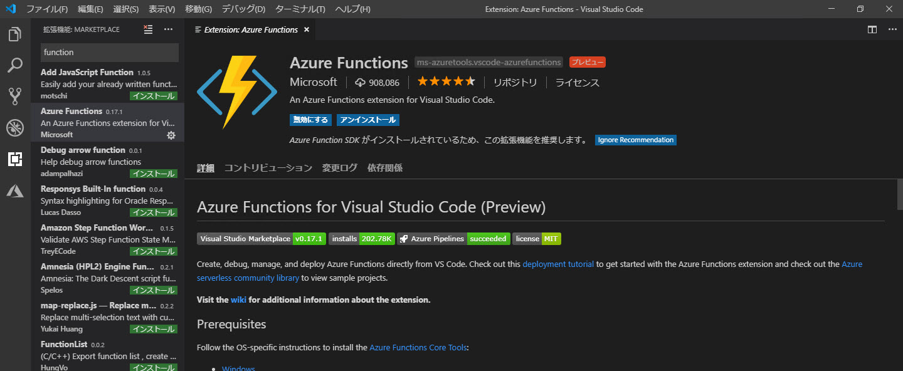
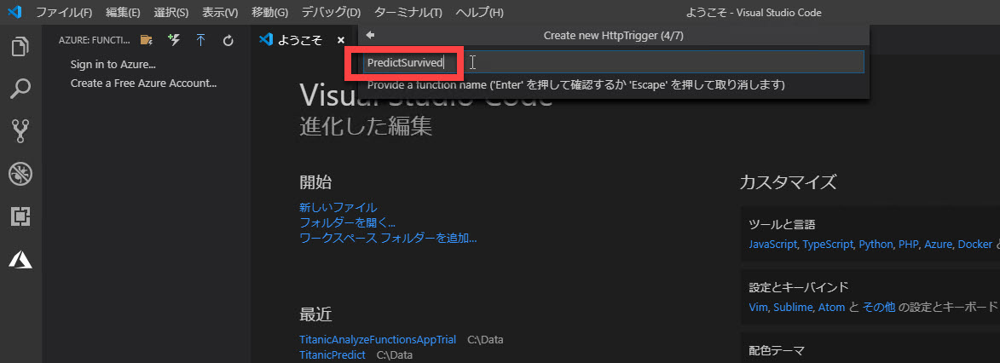
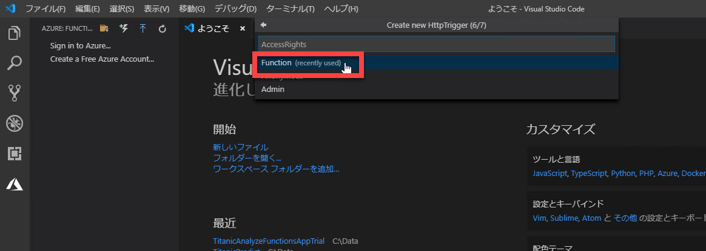
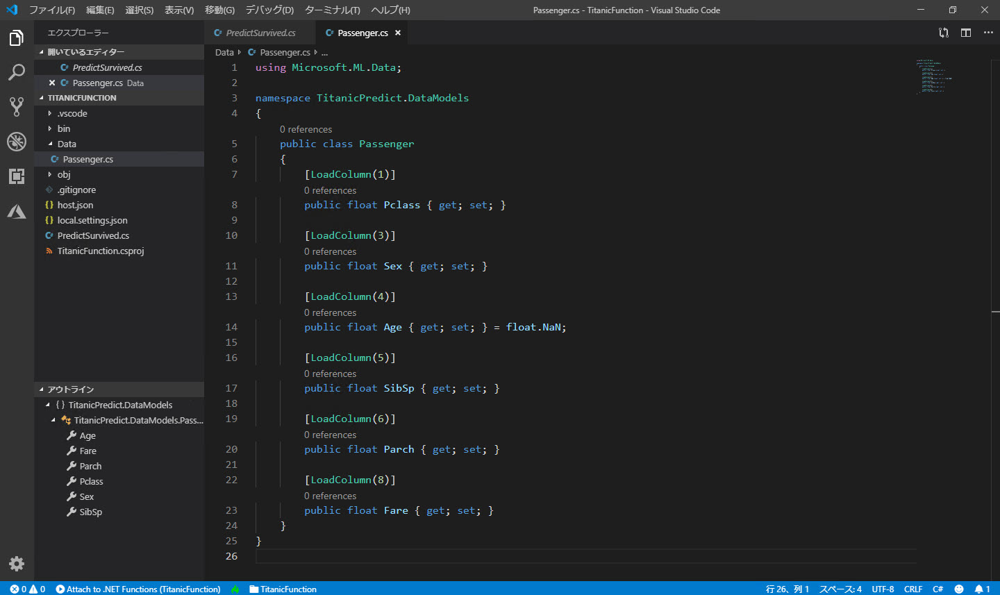

# 予測をサービス化する

[前のステップ](./05_predictmodel.md) で、予測モデルの動作を確認できました。

ここからは、予測モデルを **Azure Functions** の関数としてホストして、サービスとして利用できるようにします。  
最初に、ローカルでデバッグ実行してみます。


> Azure にデプロイするのは次のステップで行います。

---

## Functions のローカルデバッグ環境の構築

最初に Azure Functions をローカルで開発、デバッグする環境を構築します。  
[こちらのページ](https://docs.microsoft.com/ja-jp/azure/azure-functions/functions-create-first-function-vs-code) に整理されていますが、ここでも同じように進めてみます。

1. このコンテンツの [データ読み込みの準備をする](./03_prepareloaddata.md) を実施していれば次の 2個はインストール済みですが、念のため確認します。  

   - [C# for Visual Studio Code](https://marketplace.visualstudio.com/items?itemName=ms-vscode.csharp)
   - [.NET Core CLI ツール](https://docs.microsoft.com/ja-jp/dotnet/core/tools/?tabs=netcore2x)

2. [**Azure Functions**](https://marketplace.visualstudio.com/items?itemName=ms-azuretools.vscode-azurefunctions) 拡張機能をインストールします。  
   

---

## Azure Functions プロジェクトと関数の作成

Azure Functions プロジェクトを作成して、予測のための関数を作成します。

1. Visual Studio Code を開きます。
2. アクティビティバーの [**Azure**] をクリックします。
3. [**Create New Project**] をクリックします。  
   プロジェクト用のフォルダーを求められるので、新しいフォルダーを作って、そのフォルダーを指定します。（ここではフォルダー名は "**TitanicFunction**" とします。）  
   

4. [**Select a language for your function**] の選択を求められます。ここでは "**C#**" を選択します。  
   

5. [**Select a template ～**] の選択を求められます。"**HttpTrigger**" を選択します。  
   

6. [**Provide a function name**] の入力を求められます。ここでは関数名として "**PredictSurvived**" と入力します。  
   

7. [**Provide a namespace**] の入力を求められます。ここでは名前空間として "**TitanicFunction**" と入力します。  
   

8. [**AccessRights**] の選択を求められます。ここでは "**Function**" を選択します。  
   

9. [**Select how to open ～**] の選択を求められます。ここでは "Open in current window" を選択します。  
    

10. **プロジェクトの復元** を求められます。[**Restore**] ボタンをクリックします。  
    

11. 念のため、ここで一度 Function をローカルでデバッグ実行します。  
    [**デバッグ**]-[**デバッグの開始**] をクリックします。ビルドが始まり、自動的に関数がデバッグ実行されます。  
    "**ターミナル**" が開いて、Functions のバナーが表示されれば成功です。  
    

    > デバッグ実行を終了するには、ツールバーの [**デバッグ**]-[**デバッグの停止**] を選択します。

---

## Microsoft.ML パッケージのインストール

"Microsoft.ML" パッケージをプロジェクトに追加します。

1. Visual Studio Code のメニューで [**表示**]-[**ターミナル**] を選択します。  
   ターミナルが "PowerShell" ならば、そのままで手順を進めます。

   > ターミナルが "タスク - build" などの場合は（"PowerShell" でない場合）、[**+**] で "**PowerShell**" の新しいターミナルが開くのを確認します。  
   > 

2. "Microsoft.ML" および "Microsoft.Extensions.ML" パッケージをインストールします。  
   ターミナルで以下の入力をします。

   ```cmd
   dotnet add package Microsoft.ML
   dotnet add package Microsoft.Extensions.ML
   ```

   

---

## エンティティクラスの定義

予測のためにエンティティを 2つ定義します。

- 入力パラメーター用のエンティティ
- 予測結果のエンティティ

ここから、これらのエンティティクラスを定義します。

1. Visual Studio Code の **エクスプローラー** で [**新しいフォルダー**] をクリックして、"**Data**" フォルダーを作ります。
2. Visual Studio Code のエクスプローラーで "**Data**" フォルダーを選択した状態で、[**新しいファイル**] をクリックしてファイルを追加します。  
   ファイル名は　"**Passenger.cs**"  とします。
3. "**Passenger.cs**" 全体を以下のコードで置換します。

   ```csharp
   using Microsoft.ML.Data;

   namespace TitanicPredict.Data
   {
    public class Passenger
       {
           [LoadColumn(1)]
           public float Pclass { get; set; }

           [LoadColumn(3)]
           public float Sex { get; set; }

           [LoadColumn(4)]
           public float Age { get; set; } = float.NaN;

           [LoadColumn(5)]
           public float SibSp { get; set; }

           [LoadColumn(6)]
           public float Parch { get; set; }

           [LoadColumn(8)]
           public float Fare { get; set; }
       }
   }
   ```

   

4. Visual Studio Code のエクスプローラーで "**Data**" フォルダーを選択した状態で、[**新しいファイル**] をクリックしてファイルを追加します。  
   ファイル名は　"**PassengerPredict.cs**"  とします。
5. "**PassengerPredict.cs**" 全体を以下のコードで置換します。

   ```csharp
   using Microsoft.ML.Data;

   namespace TitanicPredict.Data
   {
       public class PassengerPredict : Passenger
       {
           [ColumnName("PredictedLabel")]
           public bool Prediction { get; set; }

           public float Probability { get; set; }

           public float Score { get; set; }
       }
   }
   ```

   

   > "**Prediction**" プロパティは、カラム名として "**PredictedLabel**" を与えます。  
   > ML.NET はデフォルトでこのカラムに予測結果を入れます。

> [前のステップ](./05_predictmodel.md) の予測では、入力用のパラメーター（説明変数）のみ定義しました。  
> 前のステップでは予測に "**ITransformer.Transform**" メソッドを使いました。これは入力用のパラメーターに対して、予測結果のカラムとして "**PredictedLabel**" を自動的に追加します。このため予測結果のエンティティを明示的に定義する必要はありません。  
>
> 以下では **PredictionEnginePool** の **Predict** メソッドを使いますが、この場合は予測結果のエンティティも必要です。

---

## 学習済みモデルをプロジェクトフォルダー内に配置

[**モデルを作成する**](./04_createmodel.md) ステップで作成して保存した **学習済みモデル** のファイルを予測サービスのプロジェクトにコピーします。

1. Visual Studio Code の **エクスプローラー** で [**新しいフォルダー**] をクリックして、"**Models**" フォルダーを作ります。
2. "Models" フォルダーに、[**モデルを作成する**](./04_createmodel.md) ステップで保存した "TrainedModel.zip" をコピーします。  
   
3. "**titanicfunction.csproj**" ファイルを開き、"**\</Project\>**" の上に、以下のコードを追加します。

   ```xml
   <ItemGroup>
     <Content Include="Models\TrainedModel.zip">
       <CopyToOutputDirectory>PreserveNewest</CopyToOutputDirectory>
     </Content>
   </ItemGroup>
   ```

   

---

## 予測エンジンを追加する

Azure Functions で ML.NET で作成したモデルを使用して予測するには、**PredictionEnginePool** をプロジェクトに追加します。

1. Visual Studio Code のエクスプローラーで、[**新しいファイル**] をクリックしてファイルを追加します。  
   ファイル名は　"**Startup.cs**"  とします。
2. "**Startup.cs**" 全体を以下のコードで置換します。

   ```csharp
   using Microsoft.Azure.WebJobs;
   using Microsoft.Azure.WebJobs.Hosting;
   using Microsoft.Extensions.ML;
   using TitanicPredict;
   using TitanicPredict.Data;

   [assembly: WebJobsStartup(typeof(Startup))]
   namespace TitanicPredict
   {
       class Startup : IWebJobsStartup
       {
           public void Configure(IWebJobsBuilder builder)
           {
               builder.Services.AddPredictionEnginePool<Passenger, PassengerPredict>()
                   .FromFile("Models/TrainedModel.zip");
           }
       }
   }
   ```

   

3. Visual Studio Code のエクスプローラーで、[**新しいファイル**] をクリックしてファイルを追加します。  
   ファイル名は　"**extensions.json**"  とします。
4. "**extensions.json**" 全体を以下のコードで置換します。

   ```json
   {
       "extensions": [
           {
           "name": "Startup",
           "typename": "TitanicFunction.Startup, TitanicFunction, Version=1.0.0.0, Culture=neutral, PublicKeyToken=null"
           }
       ]
   }
   ```

5. "**PredictSurvived.cs**" を開きます。
6. "**PredictSurvived.cs**" 全体を以下のコードで置換します。

   ```csharp
   using System;
   using System.IO;
   using System.Threading.Tasks;
   using Microsoft.AspNetCore.Mvc;
   using Microsoft.Azure.WebJobs;
   using Microsoft.Azure.WebJobs.Extensions.Http;
   using Microsoft.AspNetCore.Http;
   using Microsoft.Extensions.Logging;
   using Newtonsoft.Json;
   using Microsoft.Extensions.ML;
   using TitanicPredict.Data;

   namespace TitanicPredict
   {
       public class PredictSurvived
       {
           [FunctionName("PredictSurvived")]
           public async Task<IActionResult> Run(
               [HttpTrigger(AuthorizationLevel.Function, "get", "post", Route = null)] HttpRequest req,
               ILogger log)
           {
               log.LogInformation("C# HTTP trigger function processed a request.");

               var requestBody = await new StreamReader(req.Body).ReadToEndAsync();
               var data = JsonConvert.DeserializeObject<Passenger>(requestBody);

               var prediction = _predictionEnginePool.Predict(data);

               var sentiment = Convert.ToBoolean(prediction.Prediction) ? "Survived" : "Not Survived";
               return new OkObjectResult(sentiment);
           }

           private readonly PredictionEnginePool<Passenger, PassengerPredict> _predictionEnginePool;

           public PredictSurvived(PredictionEnginePool<Passenger, PassengerPredict> predictionEnginePool)
           {
               _predictionEnginePool = predictionEnginePool;
           }
       }
   }
   ```

   

以上で、予測サービスのコーディングは終了です。  
クライアント（今回は Postman）から予測サービスを呼び出してみます。

---

## Postman をインストール

もし、まだ　[**Postman**](https://www.getpostman.com/downloads/) をインストールしていなければ、ここでインストールします。

1. [**Postman**](https://www.getpostman.com/downloads/) をダウンロード、インストールします。
2. Postman を起動します。

---

## 予測サービスを Postman から呼び出す

1. Visual Studio Code で、[**デバッグ**]-[**デバッグの開始**] をクリックします。
2. Function が実行されて、ターミナルに URL が表示されます。  
   "**<http://localhost:7071/api/PredictSurvived>**" のような URL になっているはずです。  
   

3. Postman に必要な情報を埋めていきます。  
  
   |区分|項目|値|
   |---|---|---|
   |リクエスト|メソッド|POST|
   |リクエスト|URL|すぐ上の手順でターミナルに表示された URL|
   |Header|Content-Type|application/json|
   |Body|("Raw" に切り替えて)|以下のような JSON を入力（値は適当に他の値に変更して）|

   ```json
   {
       "Pclass": 1,
       "Sex": 0,
       "Age": 20,
       "SibSp": 1,
       "Parch": 0,
       "Fare": 30
   }
   ```

   
   

4. [**Send**] ボタンをクリックします。予測結果（"Survived" または "Not Survived"）が返ってきます。
   

---

以上で、予測サービスの作成と実行、またクライアントからのリクエストができました。  
[**最後のステップ**](./07_deploytoazure.md) では、今作った Function を Azure にデプロイします。
