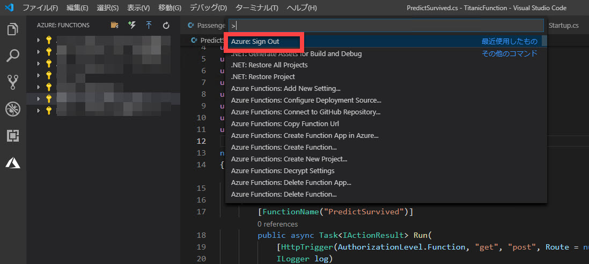
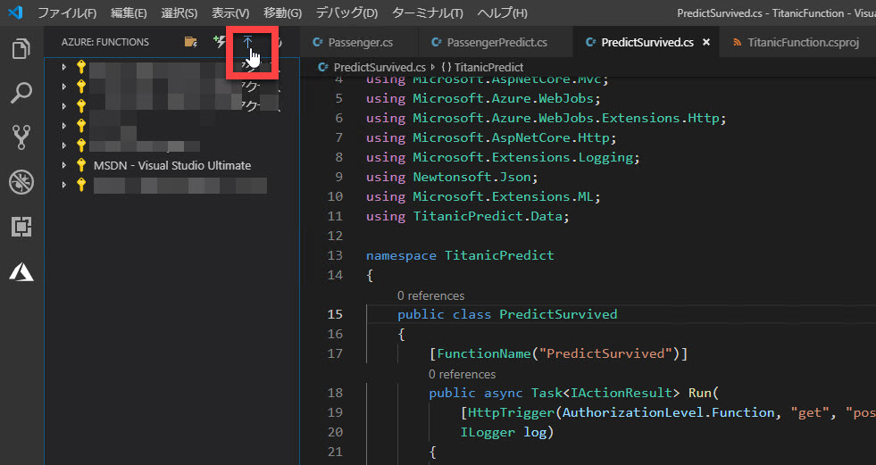
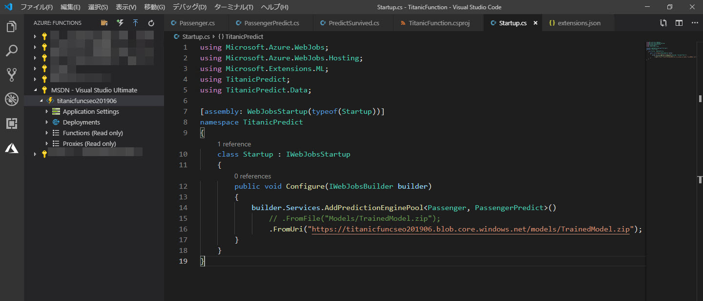
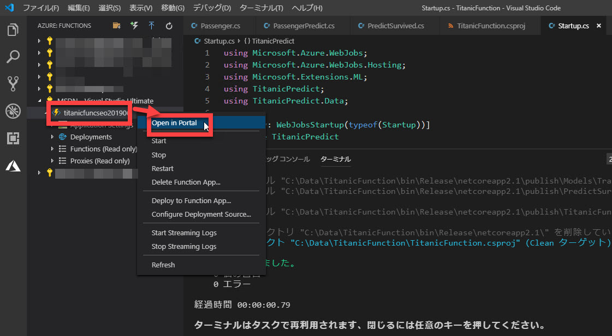
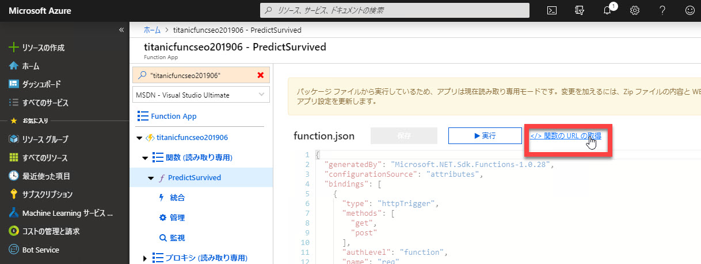

# 予測サービスをクラウドに発行する

[**前のステップ**](./06_createfunctions.md) で、予測サービスを作成して、ローカルでデバッグ実行しました。

このステップではコンテンツの仕上げとして、

- 作成したサービスを Azure に発行
- クライアントから呼び出し

を行います。

> Azure サブスクリプションを持っていない場合は、[こちら](https://azure.microsoft.com/ja-jp/free/) で無償アカウントを作成してください。

---

## Azure にサインインする

1. アクティビティバーの [**Azure**] をクリックします。
2. （まだ Azure にサインインしていない場合のみ） [**Sign in to Azure**] でサインインします。  
   

3. サインインに成功した場合、または、すでにサインインしている場合には、アクセス可能なサブスクリプションが表示されます。  

   > Visual Studio Code に Functions 以外の Azure 関連の拡張機能をインストール済みの場合は、それらのセクションも表示されます。  
   > 以下の手順では [**AZURE: FUNCTIONS**] のセクションで操作します。

     

> 複数のアカウントを持っていて、関数のデプロイ対象にしたいサブスクリプションが表示されていない場合は、いったんサインアウトします。
>
> 1. "**Ctrl+Shift+P**" で Visual Studio Code のコマンドパレットを開きます。
> 2. "**Azure: Sign Out**" を入力または選択して、サインアウトします。
>
> 

---

## Azure Functions に関数を作成する

[前のステップ](./06_createfunctions.md) でローカルでの実行に成功した予測サービスを Azure Functions にデプロイします。

1. [**Deploy to Function App**] をクリックします。  
   

2. [**Select a Subscription**] で、デプロイするサブスクリプションを選択します。  
   

3. [**Create New Function App**] をクリックします。  
   

4. Function App の名前を入力します。  
   他のアプリケーションとは完全に異なる名前にする必要があるため、例えば "titanicfunc" などと、自分の名前、日付などを組み合わせて、名前を決めます。  
   

5. これで Azure 上に Function App が作成されます。  
   少し待って、"Deployment to \<Function App 名\> competed" メッセージが表示されることを確認します。  
   

---

## Function App の設定変更

ML.NET のモデルは、64ビットのプラットフォームで実行する必要があります。

1. 作成した **関数で右クリック** して [**Open in Portal**] を選択します。  
   

2. ブラウザーで Azure ポータルが開いたら、[**<作成した Function App>**]-[**プラットフォーム機能**] を選択します。  
   ]

3. [**全般設定**]-[**構成**] を選択します。  
   

4. [**プラットフォームの設定**]-[**プラットフォーム**] を "**64 Bit**" に変更して、[**保存**] をクリックします。  
   

---

## Blob に学習済みモデルファイルを配置する

学習済みモデルのファイルを **Blob** ストレージに配置します。  
再学習した際などにもモデルファイルを変更するだけでより精度の高い予測ができるようになるなどのメリットがあります。

1. Azure ポータルの検索窓で "titanic" を検索します。  
   "**ストレージアカウント**" が検索結果に表示されるので、これを選択します。

   > Function App 名として "titanic" 以外の文字列を使った場合は、それに応じた検索をします。

   

2. [**BLOB**] を選択します。  
   

3. [**コンテナー**] を選択します。
4. [名前] に "**models**" を指定します。
5. [**パブリックアクセスレベル**] で "**BLOB (BLOB 専用の匿名読み取りアクセス)**"
6. [**OK**] をクリックして、コンテナーを作成します。  
   

7. "**models**" ストレージアカウントを選択します。  
   

8. [**アップロード**] を選択して、[モデルを作成する](./04_createmodel.md) ステップで保存した "TrainedModel.zip" ファイルをアップロードします。  
   

9. アップロードに成功したら、"**TrainedModel.zip**" を選択します。
    

10. "TrainedModel.zip" の [**URL**] をクリップボードにコピーします。  
    この値はあとで使います。

    

---

## ソースコードの一部変更

Blob にアップロードした学習済みモデルのファイル "TrainedModel.zip" を使用して予測するように、ソースコードを変更します。

1. Visual Studio Code に戻って、"**Startup.cs**" を開きます。
2. "**Configure**" メソッドを以下のように変更します。  

   ```csharp
   public void Configure(IWebJobsBuilder builder)
   {
       builder.Services.AddPredictionEnginePool<Passenger, PassengerPredict>()
           // .FromFile("Models/TrainedModel.zip");
           .FromUri("<Blob ストレージにアップロードした TrainedModel.zip の URL>");
   }
   ```

   

---

## Function App にデプロイ

ソースコードを変更したので、Function App にデプロイします。

1. Azure に作成した Function App を右クリックして、[**Deploy to Function App**] を選択します。  
   

2. 確認ウィンドウが表示されたら [**Deploy**] を選択します。  
   

---

## Azure ポータルで動作確認

予測サービスが Azure Functions で動作するようになりました。  
Azure ポータルで動作確認してみます。

1. Azure に作成した Function App を右クリックして、[**Open in Portal**] を選択します。  
   

2. Azure ポータルで "**Function App ブレード**" が開いたら、[**関数 (読み取り専用)**] のドリルダウンを開いて、"**PredictSurvived**" を選択します。  
   続いて [**テスト**] タブをクリックして広げます。
   

3. [**要求本文**] に、例えば以下の JSON を入力します。  

   ```json
   {
       "Pclass": 1,
       "Sex": 0,
       "Age": 20,
       "SibSp": 1,
       "Parch": 0,
       "Fare": 30
   }
   ```

   

4. [**実行**] をクリックします。  
   [**出力**] 領域に、予測した結果が表示されます。  
   

Azure Functions 化に成功しました。

---

## 予測サービスを Postman から呼び出す

1. Azure ポータルの "**Function App ブレード**" で、[**関数 (読み取り専用)**] のドリルダウンを開いて、"**PredictSurvived**" を選択します。
2. [**関数の URL の取得**] をクリックします。  
   

3. [コピー] をクリックして、URL をクリップボードにコピーします。  
   

4. Postman を起動して、以下の必要な情報を埋めていきます。  
  
   |区分|項目|値|
   |---|---|---|
   |リクエスト|メソッド|POST|
   |リクエスト|URL|Function App の URL (Azure ポータルでコピーしたもの)|
   |Header|Content-Type|application/json|
   |Body|("Raw" に切り替えて)|以下のような JSON を入力（値は適当に他の値に変更して）|

   ```json
   {
       "Pclass": 1,
       "Sex": 0,
       "Age": 20,
       "SibSp": 1,
       "Parch": 0,
       "Fare": 30
   }
   ```

   > Postman で入力する情報は、[**予測をサービス化する**](./06_createfunctions.md) の "**予測サービスを Postman から呼び出す**" 手順を参考にしてください。  
   >今回違うのは **URL** のみです。

5. [**Send**] ボタンをクリックします。予測結果（"Survived" または "Not Survived"）が返ってきます。
   

---

以上で、このコンテンツはすべて終了です。

機械学習のデータの用意、学習、クラウドへの発行、クライアントからの利用について、実際に操作してみました。
[公式の Tutorial](https://dotnet.microsoft.com/learn/machinelearning-ai/ml-dotnet-get-started-tutorial/intro) など他の資料も参照して、機械学習の理解を深めてください。

このコンテンツへの意見、改善の提案などは、このリポジトリの Issue, Pull request でお知らせください。
