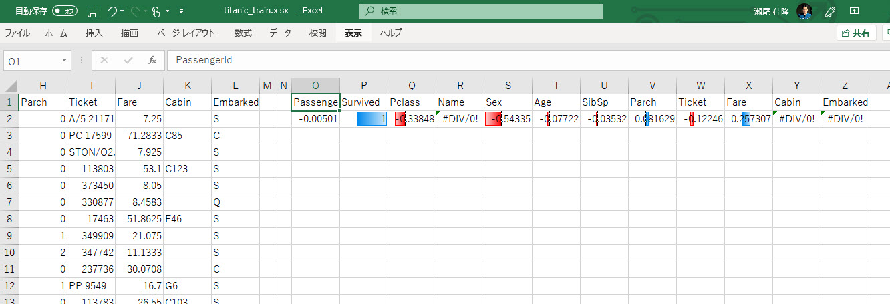
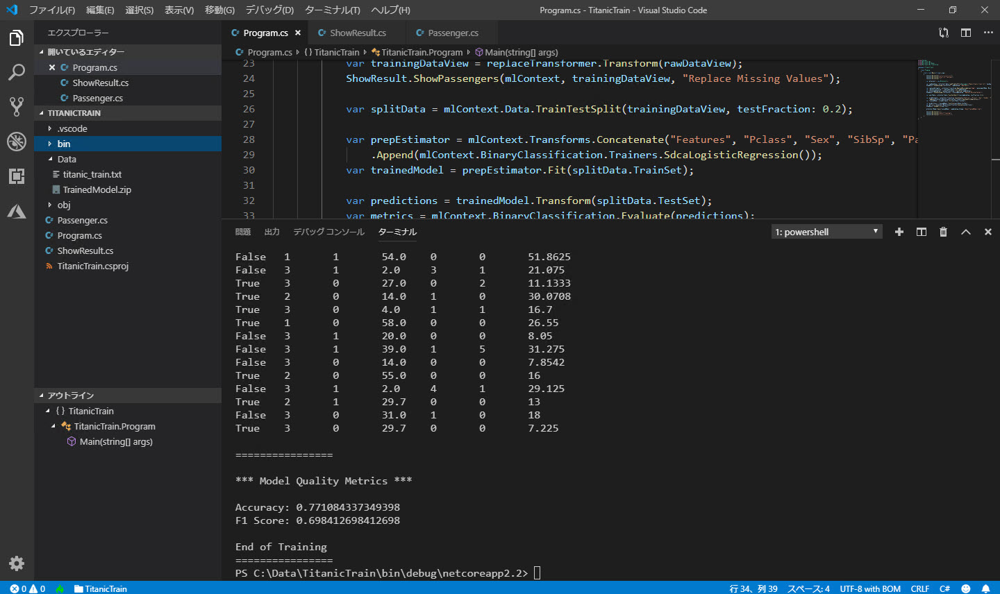
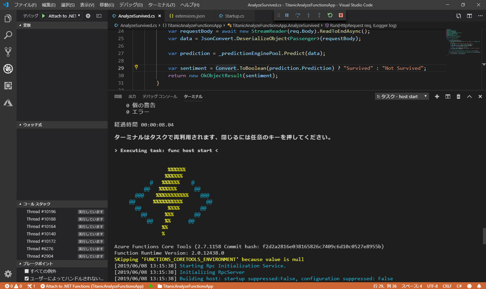
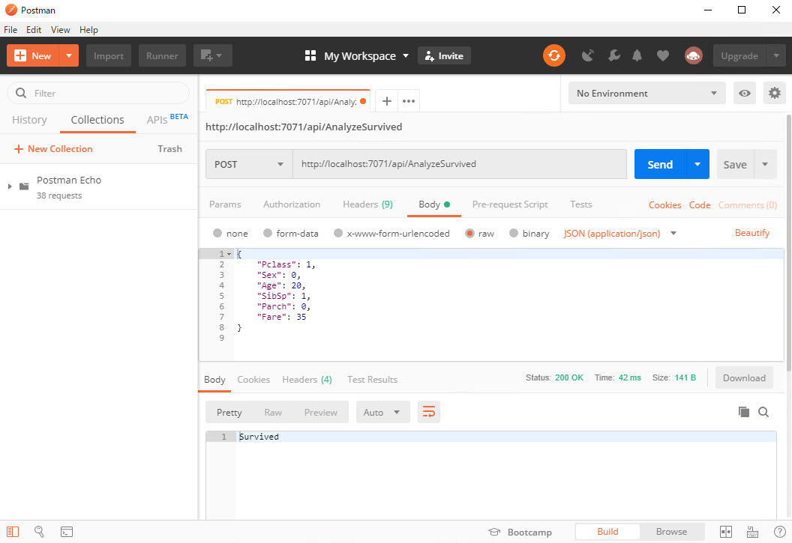

# ML.NET で二項分類 ～ タイタニック号から脱出できるか？

このコンテンツでは、[**ML.NET**](https://docs.microsoft.com/ja-jp/dotnet/machine-learning/) を使って 二項分類 を行う手順を紹介します。

このコンテンツのテーマは、**タイタニック号の乗船リスト** から、どのような属性の人が **"助かる" かを予測** することです。

機械学習には **ML.NET** を使用しますが、データの分析には **Excel** を利用してみます。  
このコンテンツでは、実装に [**Visual Studio Code**]([https://](https://code.visualstudio.com/)) を使います。

> 同様の分類モデルを作成する手順として、
>
> - [**Azure Machine Learning Studio** を使用するコンテンツ](https://github.com/seosoft/Titanic_MachineLearningStudio)
> - [**Azure Machine Learning Service Visual interface** を使用するコンテンツ](https://github.com/seosoft/Titanic_MLServiceVisualInterface)
>
> を用意しています。

---

今回は、データセットを単に **学習** するだけではなく、学習済みモデルを Azure Functions で **サービス化** してクライアントから利用する手順まで紹介します。

> このコンテンツでは、Functions のローカル実行の範囲を扱います。

機械学習（深層学習でも基本的には同様）は、以下の流れで進めます。

1. [データを用意する](./01_preparedata.md)
2. [データを整形して分析する](./02_dataanalyze.md)
3. [データ読み込みの準備をする](./03_prelaredataload.md)
4. [モデルを作成する](./04_createmodel.md)
5. [予測モデルを作成する](./05_predictmodel.md)
6. [予測をサービス化する](./06_createfunctions.md)
7. (準備中)

---

間違いや更新の提案は、Issue、Pull Request でお知らせください。
